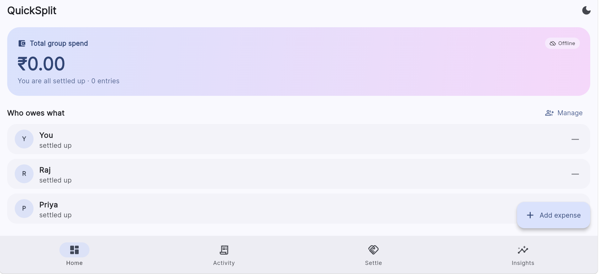
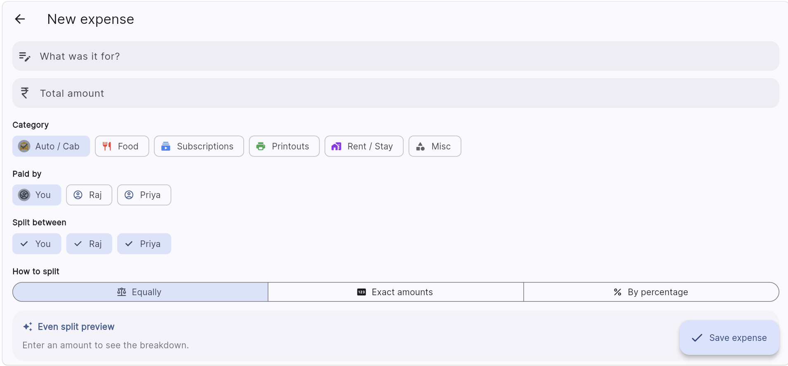
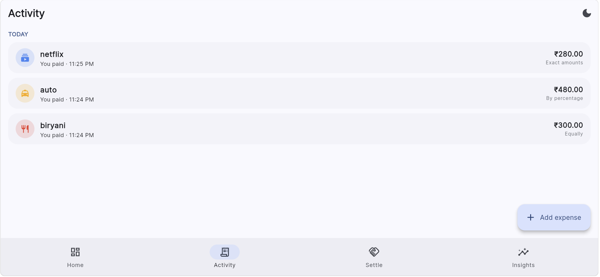
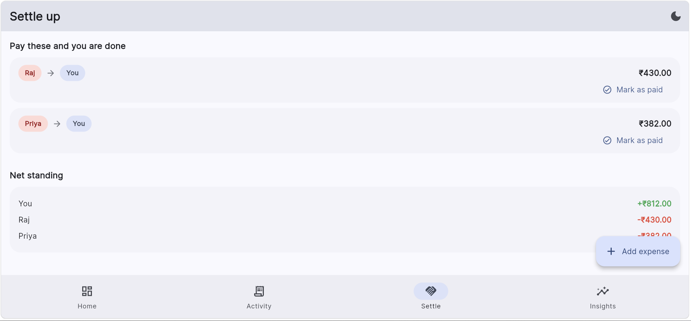
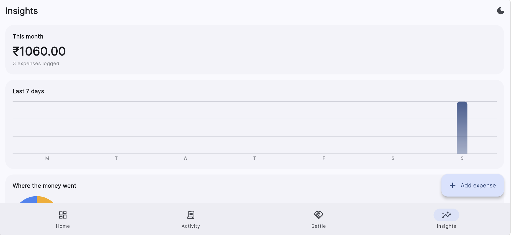
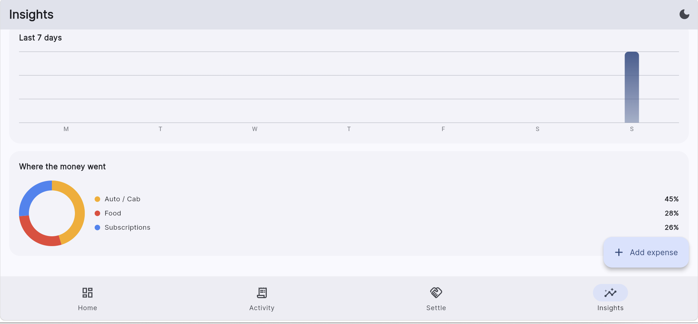
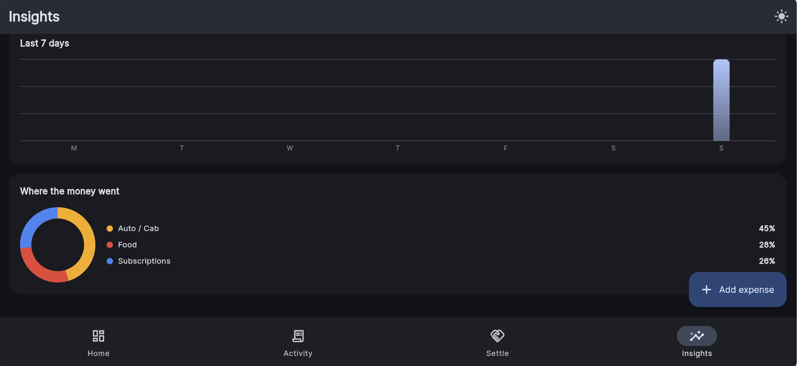

# Campus QuickSplit

**Frictionless, local-first peer expense tracker for students.**
GDG App Dev — Round 2, **Phase 2** submission.

No signup. No phone number. No network. Open the app and split a bill in under
five seconds — which is the entire point, because the auto ride you are
splitting cost ₹80 and nobody is creating an account for ₹80.

---

## Screenshots

| Dashboard | Add expense (3 modes) | Activity | Settle up | Insights |
|---|---|---|---|---|
|  |  |  |  |  |

| Light | Dark |
|---|---|
|  |  |

> Demo video: **[Google Drive link →](PASTE_YOUR_DRIVE_LINK_HERE)**

---

## Built on the Google stack

| Layer | Google technology | Why |
|---|---|---|
| Framework | **Flutter 3 / Dart 3** | single codebase, 60fps, sealed-class `switch` expressions used throughout |
| Design | **Material 3** with a `ColorScheme.fromSeed` palette seeded on Google Blue `#4285F4` | one seed colour generates a contrast-checked tonal palette for **both** light and dark — zero hand-picked hex values in the UI |
| Type | **Google Fonts (Inter)** | consistent typography across Android/iOS |
| Motion | `AnimatedSwitcher`, `TweenAnimationBuilder`, `Dismissible` | tab transitions, charts that grow on paint, swipe-to-delete |
| Charts | **`CustomPainter` on `dart:ui` Canvas** | hand-drawn bar + donut charts, **no third-party charting package** |
| Storage | **Hive** (pure-Dart NoSQL, `path_provider` backed) | offline-first key-value store, no codegen, instant cold start |
| State | **Provider** + `ChangeNotifier` | Google-recommended baseline state management |

---

## Phase 2 requirements — how each one is met

### 1. Granular allocation modes

| Mode | Implementation |
|---|---|
| **Uniform** | `SplitEngine.uniform()` — integer-paise division with deterministic remainder handling. ₹100 across 3 people becomes **₹33.34 / ₹33.33 / ₹33.33**, never `33.333…`. The shares are asserted to sum back to the exact bill total. |
| **Specific value** | Live `unallocated` counter recomputed on every keystroke — *"₹40.00 left to assign"* turns green only at exactly zero. Over-allocation is caught and reported separately. |
| **Ratio-based** | Percentages held in **basis points** (1% = 100 bp) and hard-capped at 10 000 bp. Rounding leftovers are pushed onto the largest share so the total is preserved to the paisa. Each row shows its live rupee equivalent as you type. |

> **The money model:** every amount in this app is an `int` of **paise**, never a
> `double`. Floating point cannot represent ₹0.10 exactly; a splitting app that
> uses `double` silently leaks fractions of a rupee on every uneven split. This
> is the single most important design decision in the codebase.

### 2. Local-first storage

`Store` (`lib/core/store.dart`) wraps three **Hive** boxes — `people`, `expenses`,
`prefs` — opened once at startup before `runApp`. Every mutation writes through
immediately, so a force-kill mid-session never loses a transaction. Theme choice
is persisted the same way. **Turn on airplane mode and the app is 100 % functional.**

### 3. Settlement optimisation

`SplitEngine.settle()` collapses the debt web into the minimum number of
transfers:

- Split participants into creditors (net > 0) and debtors (net < 0), each sorted descending.
- Repeatedly match the **largest creditor with the largest debtor** and cancel the smaller of the two.
- Every pass zeroes out at least one participant → terminates in **at most n−1 transfers**, the floor for a debt graph with no coincidental subset sums.
- Complexity: **O(n log n)**.

The Settle screen shows the win explicitly: *"7 raw IOUs collapsed into 2 transfers."*

---

## Also implemented (Phase 3 groundwork)

- **Swipe-to-delete with UNDO** — the row leaves, balances recompute instantly, and the snackbar restores the exact record if tapped.
- **Custom-drawn analytics** — animated 7-day bar chart and a category donut, both pure `CustomPainter`.
- **Light + dark mode** with the preference saved to Hive.
- **Multi-payer data model** — `Expense.payers` is already a `Map<personId, paise>`, so split-payment bills need no schema migration.

---

## Input sanitisation

| Guard | Behaviour |
|---|---|
| Empty title | blocked, inline error |
| Title > 60 chars | blocked |
| Empty / non-numeric amount | blocked |
| Zero or negative amount | blocked (`FilteringTextInputFormatter` also refuses `-` at the keyboard) |
| More than 2 decimal places | refused at input |
| Absurd amount (> ₹10 lakh) | blocked |
| No participants selected | blocked, inline error |
| Exact mode not summing to the total | blocked with the signed shortfall/overage |
| Percentages ≠ 100 % | blocked with the running total |
| Duplicate member name | blocked |
| Removing a member with an open balance | disabled — that would destroy money in the ledger |

---

## Architecture

```
lib/
├── main.dart                    theme + bootstrap (Hive opened before runApp)
├── core/
│   ├── models.dart              Person, Expense, SplitMode, Category, Settlement
│   ├── split_engine.dart        ← ALL business logic. Zero Flutter imports.
│   ├── store.dart               Hive persistence layer
│   └── app_state.dart           ChangeNotifier — the single source of truth
└── screens/
    ├── home_shell.dart          NavigationBar + animated tab switching
    ├── dashboard_screen.dart    aggregated balance view
    ├── add_expense_screen.dart  the three allocation modes + validation
    ├── activity_screen.dart     day-grouped log, swipe-to-delete + undo
    ├── settle_screen.dart       optimised repayment plan
    ├── insights_screen.dart     CustomPainter bar + donut charts
    └── people_screen.dart       group member management
```

**Logic separation is strict.** `split_engine.dart` imports nothing from
Flutter — it is plain Dart, which is exactly why it can be unit-tested without
a widget tree:

```bash
flutter test
```

`test/split_engine_test.dart` covers remainder handling, over/under allocation,
percentage rounding, balance netting, and proves the settlement optimiser turns
a 4-IOU debt web into 2 transfers.

---

## Run it

```bash
# 1. generate the platform folders for this machine
flutter create . --platforms=android,ios

# 2. dependencies
flutter pub get

# 3. verify the logic
flutter test

# 4. run
flutter run
```

Requires Flutter 3.29+ / Dart 3.3+.

---

## Why this design

Existing splitters are cloud-first: mandatory signup, a sync spinner, an
account for a person you will share exactly one auto ride with. QuickSplit
inverts that — the database is a local file, group members are just names, and
the network is never on the critical path. Sync can be added later as an
*optional* layer; friction cannot be removed later.
